<h1 align="center"><em>b</em>Boulder Website</h1>
Created for the purpose of advertising <em>b</em>Boulder; a fictional indoor bouldering centre that also focuses on maintaining physical wellbeing. The website will showcase the facilities through images/videos, provide useful information regarding the location and services available.
 

#### [View the live project here](https://dalefielding.github.io/b-boulder/)

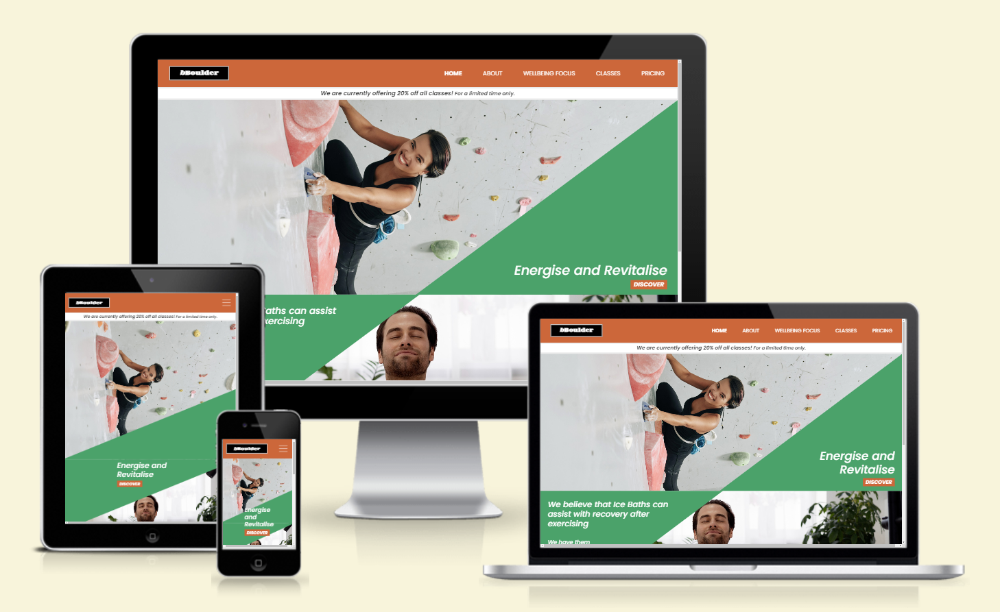

## User Experience (UX)

-   ### User Stories/Visitor Goals
    * As a user, I would like to be see information relating to services available.
    * As a user, I would like to be see information relating to classes available
    * As a user, I would like to view prices for the above.
    * As a user, I would like to access contact information for the company 
    * As a user, I would like to access the location of the company
    * As a user, I would like to see imagery relating to safety information

-   ### Client Objectives
    The company bBoulder would like:
    *  A website built that will promote their business and encourage visits to their centre.
    * They have asked for a website that that is responsive, functional and professional.
    * They would like it to be aimed at the general public of all ages, as their are virtually no restrictions in terms of age regarding bouldering at their facilities.
    * They have a focus on wellbeing and injury prevent so would like this to be made clear in the content. 

-   ### Developer Objectives 
    * To design and build a site that meets the clients objectives and factoring what a user would want from this site.
    * To ensure that the website meets all accessibility requirements, allowing anyone to use regardless of their abilities/needs
    * To carry out other manual testing on each page and with other device sizes.
    * To carry out testing using validators and google lighthouse in order to minimise any warnings or errors that the site may contain.
    * To fix any bugs that there might be in the site.

### Design
* #### Strategy 
    Is based on users stories, visitor goals, client objectives and developer objectives; As above.
* #### Scope
    I have listed the possible features below and ranked 1-5 in level of importance/relevance to user needs (1 being most important and viable/feasible):
    * Classes for children and adults (1) 
    * Location/map (1)
    * Site navigation (1)
    * Accessibility (1)
    * Social networking information and links (1)
    * Wellbeing services; Ice baths, osteopathy, stretching/warm up/cool down area (1)
    * Logo (1)
    * Slogan (2)
    * Booking information for (2)
    * Safety information (2)
    * Images/gallery (2)
    * Background image (2)
    * Video footage (3)
    * Fully functional calendar for booking (4)
    * Animated climber that climbs up and down on the side of the page when scrolling (5)
    * Bar to indicate current level of busyness (5)

Following research and review of scope, I had decided not to include:
* The animated climber - I believe this would distract from the content, would require levels of JavaScript that are outside of the project scope and would take up more time than appropriate for the value provided.
* Bar to indicate current level of busyness - this would require levels of JavaScript that are outside of the project scope currently, and do not feel it is entirely necessary as far as user/client needs are concerned. 
* Fully functional calendar for bookings - again this will require JavaScript that is outside the scope of this project at this time. The client has not indicated that this is an expectation as they generally have a just turn up policy.

I have including the remaining features within the site, implementing with HTML, CSS, JS and Bootstrap.

* #### Structure:
    - Consistency: 
        - Navigation to each page of the site will be displayed inline (by wording) on the top of each page when in desktop/tablet view. This will be reduced into a nested list for the mobile view and will expand to block view when hamburger icon is clicked.
        - Social networking will be displayed in the form of icons at the bottom of each page, and will open in a separate tab when clicked        
        - Content, imagery will have the same consistent flexible Bootstrap grid style across all pages.
        - Animations etc will act consistently across all pages
    - Predictability/Learnability: 
        - Content will appear and operate in predictable ways, based on usual site interactions
        - Accessibility; making text readable and understandable, providing text alternatives/captions for screen readers etc. 
        - Semantic HTML will be used throughout
        - Clicking on the logo will direct to the homepage
    - Visibility:
        - All elements will be made visible on all devices where appropriate, discoverable and will include content hinting.
    - Feedback:
        - Hover events for each link
        

* #### Skeleton:
    * Habits and conventions; users will navigate through the site by scrolling down the pages, through links in the navbar, media within the pages, icons and links within the footer (at the bottom)

  * ##### Wireframes:
    Initial designs created on paper then by using Adobe Powerpoint.

    *   [Initial Sketches](/assets/resources/initial-sketches.png "Link to initial sketches image file")
     
    * [Initial Home Page Wireframes](assets/resources/initial-home-page-wireframes.png "Link to initial home page wireframes image file")
     
    * [Initial Home Page Wireframes With Design Ideas](assets/resources/initial-home-page-wireframes-with-style.png "Link to initial home page wireframes with style image file")
     
    * [Initial Home Page Wireframes Chosen Design](assets/resources/initial-home-page-chosen-style.png "Link to initial home page chosen style image file")

    I progressed to using Figma and developed further by including layouts for the other pages and arrows to demonstrate navigation to these pages:

    Mobile Wireframes:
    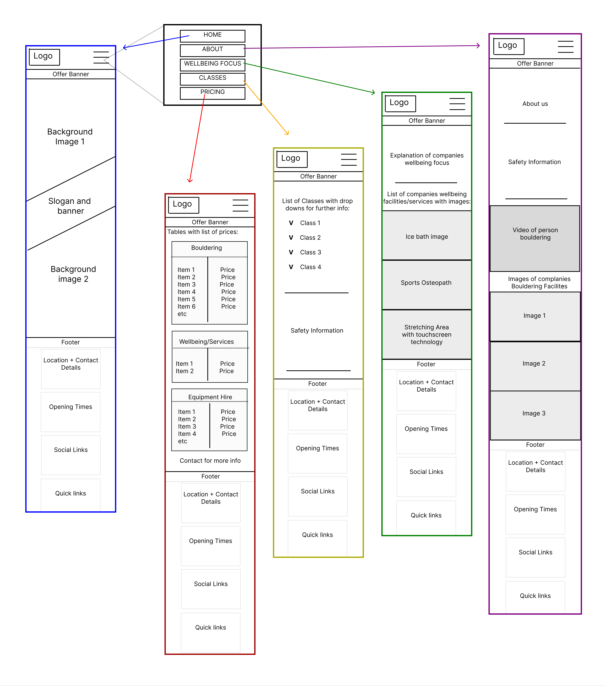
     
    Desktop Wireframes: 
    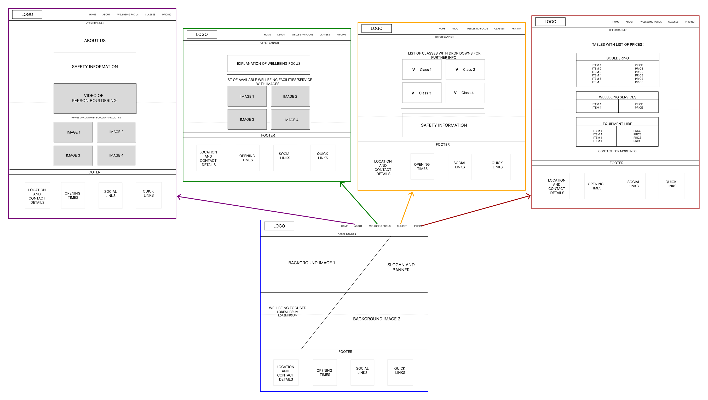

    All of these designs can be viewed more closely by visiting my figma page below:

    [Figma Wireframes Designs Page](https://www.figma.com/file/9Ioehs6ELzng3FZX2CQiR8/Page-Wireframes-for-bBoulder-Climbing-Centre-Site?type=design&node-id=21-1157&mode=design&t=Xg50D9xzmFzjb80e-0 "Link to Figma Wireframe Designs Page")
     
    

* #### Surface:
    * ##### Habits and conventions
        * Users will navigate through the site by scrolling down the pages, through links in the navbar, media within the pages, icons and links within the footer (at the bottom)
    * ##### Typography
        * I have chosen the [Poppins](https://fonts.google.com/?query=poppins "link to Poppins google font") google font for the headers on my site as I felt this was a clear, readable font that was also pleasing to the eye. After researching, I have found a couple of other google fonts that complement this nicely; [Gravitas One](https://fonts.google.com/specimen/Gravitas+One?preview.text=bBoulder&query=Gravitas+One "link to Gravitas One google font") for the logo, and [Vollkorn](https://fonts.google.com/?query=vollkorn "link to Volkorn google font") for the general content.

    * ##### Colour Scheme:
        I have chosen to go with a colour palette that represents the feeling of the experience that the company offers:
        - Orange (HEX #d46333); fun, happiness, dynamic. 
        -  Green (HEX #3da369); renewal, healing, harmony.   
        I had initially gone for a much darker green (#04861E) then I actually wanted in order to pass the contrast check. However when playing around to achieve a more preferable green, I noticed the new green does pass when using large text for the foreground; which is my only intention for this green on the site.

        I will also be using white, black and grey as neutral colours/shades for typography and background sections.

        I used a contrast checker on webaim.org to ensure that the color scheme meets the Web Content Accessibility Guidelines for readability. 

## Features
* Responsive on all device sizes
* Meta descriptions to improve SEO
* Semantic elements, alt attributes and sr attributes to assist with accessibility/screen readers 
* Logo that directs to home page
* Navigation is sticky to ensure it is always accessible at the top of the page. Has links with active status and underline when hovered over
* Navigation changes to hamburger menu for medium size devices and below.
* Offer banner displays towards the top until scrolled down the page
* Background images scale to always fit the full width of the page
* Background banner changes between two different designs depending on device type
* Footer has displays opening times, quick links, icons for social media and a location icon that directs to google maps. The footer links include a color transition in keeping with the navigation color. The layout of the footer adjusts to suit the type of device. 

* About page contains: 
    * Safety information
    * Video showcasing bouldering facilities
    * Four images showcasing bouldering facilities
* Wellbeing Focus contains:
    * A statement relating to the companies wellbeing focus.
    * Three images that relate to the facilities on site that assist with wellbeing, including a description for each one.
* Classes page contains: 
    * An accordion which has each of the classes that are on often, which expands when clicked to give a description about each one.
    * Safety information included in this page also; in case the user has decided not to the about page.
* Classes page contains: 
    * Confirmation that registration and joining is free and that customers can just turn up on the day.
    * Four tables which confirm the prices for each service; Bouldering sessions, classes, wellbeing facilities and equipment hire. There is also the inclusion of email contact details for oestopathy, to find out availability.

## Future Implementations
* An error page, used to indicated if a user has tried to access an incorrect path within the domain
* A fully functional calendar for making booking for osteopathy and potentially classes as well. This will respond to user to inform them whether or not the booking was successful.

## Testing 

The W3C Markup Validator and W3C CSS Validator Services were used to validate every page of the project to ensure there were no syntax errors or warnings in the project.

### W3C Markup Validator - Results:
* [Home page](https://validator.w3.org/nu/?doc=https%3A%2F%2Fdalefielding.github.io%2Fb-boulder%2F) 
* [About page](https://validator.w3.org/nu/?doc=https%3A%2F%2Fdalefielding.github.io%2Fb-boulder%2Fabout.html) 
* [Wellbeing Focus page](https://validator.w3.org/nu/?doc=https%3A%2F%2Fdalefielding.github.io%2Fb-boulder%2Fwellbeing-focus.html)
* [Classes page](https://validator.w3.org/nu/?doc=https%3A%2F%2Fdalefielding.github.io%2Fb-boulder%2Fclasses.html) 
* [Pricing page](https://validator.w3.org/nu/?doc=https%3A%2F%2Fdalefielding.github.io%2Fb-boulder%2Fpricing.html)

### W3C CSS Validator - Results:
* [External stylesheet (style.css)](https://jigsaw.w3.org/css-validator/validator)

#### Page Errors/Warning Summary:
* Home page
    * Encountered no issues.
* About page
    * There was an error due to px measurements being used for height and width of the video.  Fixed by deleting px in those measurements.
    * There was an error due to an alt attribute being included in the video.  Fixed by removing that.
* Wellbeing Focus page
    * Encountered no issues.
* Classes page
    * Encountered no issues.
* Pricing page
    * There were errors due to scope attributes being included with the td elements, with suggestion to include these on the th elements instead.  Fixed this by deleting the scope attributes from the td elements. Scope attributes were already included within the th elements.
    * There were warnings due to table rows not being the same column count as the first rows, and an warning to say that the table section lacks a header. These issues were because I had tried to use the table header to span the title of the table.  Fixed this by removing the tr and th elements for the tables and replacing them with a H4 tags above the table.
* External stylesheet (style.css)
    * When putting in the page URI for the webpages Came up with 16 parsing errors relating to the bootstrap CDN.
    * However when using direct input and pasting in my external CSS file, there are no errors.   There were however some warnings for the below: 
        > URI : TextArea 
        > 214
        -moz-transition is a vendor extension 
            > 215
        -webkit-transition is a vendor extension 
            > 216
        -o-transition is a vendor extension 
            > 253
        -moz-transition is a vendor extension 
            > 254
        -webkit-transition is a vendor extension 
            > 255
        -o-transition is a vendor extension 
    
    I have left those in, as this was taught in a codeinstitute course video. 

### Google Lighthouse:

* #### Mobile results
    * Home page
    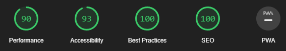
    * About page
    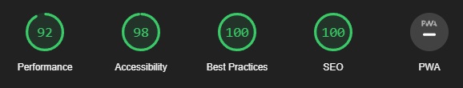
    * Wellbeing Focus page
    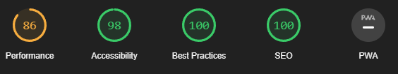
    * Classes page
    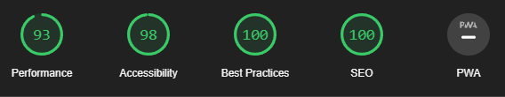
    * Pricing page
    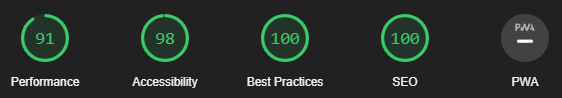

* #### Desktop results 
    * Home page
    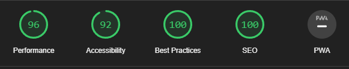
    * About page
    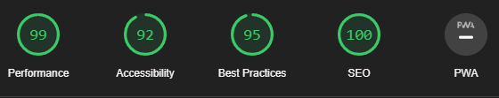
    * Wellbeing Focus page
    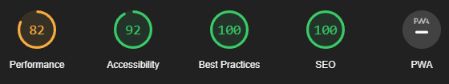
    * Classes page
    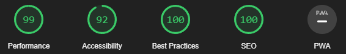
    * Pricing page
    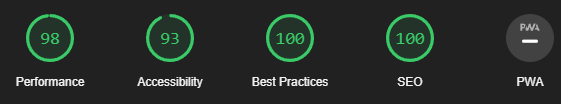

* #### Changes made due to issues flagged by Google Lighthouse

    * Added alt images and sr attributes where appropriate throughout webpages
    * Changed webpage images to be avif files instead of jpeg; for better compression
    * Included meta description tags for better search engine optimization 
    * Added smaller background images to the home page, that are then used instead of the larger images when viewing on smaller devices 

* #### Further improvements to implement: 
    * To eliminate render-blocking images; to save on load time in pages
    * Serve static assets with an efficient cache policy; to speed up site use on repeat visits
    * Smaller image file sizes for mobile view for Wellbeing Focus page and About page; to save on load time

    

## Technologies Used

### Languages Used

-   [HTML5](https://en.wikipedia.org/wiki/HTML5)
-   [CSS3](https://en.wikipedia.org/wiki/Cascading_Style_Sheets)

### Frameworks, Libraries & Programs Used

* [Bootstrap 5.3.2:](https://getbootstrap.com/docs/5.3/getting-started/introduction/)
    - Bootstrap was used to assist with the responsiveness of all pages.
* [Font Awesome:](https://fontawesome.com/)
    - Font Awesome was used on the social media links in the footer.
* [Google Fonts:](https://fonts.google.com/)
    - Google fonts were used to import the chosen fonts that were used throughout the webpages.    
* [Git](https://git-scm.com/)
    - Git was used for version control to commit to Git and Push to GitHub.
* [GitHub:](https://github.com/)
    - GitHub is used to store the projects code after being pushed from Git.
* [Visual Studio Code](https://code.visualstudio.com/)
    - Visual Studio Code was used as the IDE for the project.
* [Adobe Powerpoint](https://www.microsoft.com/en-gb/microsoft-365/powerpoint)
    - Adobe powerpoint was used to create the the initial designs/wireframes. 
* [Figma](https://www.figma.com/login?is_not_gen_0=true) 
    - Was used to add the initial wireframes/designs to a workspace, then to complete further wireframes for mobile and desktop pages.
* [Photoshop:](https://www.adobe.com/ie/products/photoshop.html)
    - Photoshop was used to resize images for the initial designs and and to save elements from Figma into individual files.
* [Pixelied](https://pixelied.com/convert/jpg-converter/jpg-to-avif)
    - Was used to convert some of the jpg images into avif files.

## Other References

### Articles
* #### Typography
    * [Creatopy font pairings article](https://www.creatopy.com/blog/google-font-pairings/)
    *  [Vev.design font pairings article](https://www.vev.design/blog/google-font-combinations/#:~:text=Poppins%20%2B%20Vollkorn,a%20header%20or%20body%20copy)

## Code

### Templates 
*  [Bootstrap Library](https://getbootstrap.com/docs/5.3/getting-started/introduction/ "link to Bootstrap Docs")
    * Has been used through the project to assist with making the pages responsive. 
    * I have some used some template code from Bootstrap documentation, such as the navbar to ensure responsiveness and a functioning collapsible menu. Also the tables in pricing.html and the accordion in classes.html.
    * I have made amendments to these in order to suit the chosen design for the website.

### Tutorials
* Used to understand how to place the two background images as desired for the homepage - 
[Youtube Tutorial](https://www.youtube.com/watch?v=iC6hzjR1luY "link to Youtube tutorial")

* Footer layout inspired by the codeinstitute resume project - 
[Codeinstitute Link](https://learn.codeinstitute.net/courses/course-v1:codeinstitute+FE+2017_T3/courseware/616289d66b5641a3808cc43e53842695/b51f7b8b815c4bcd9979d2281b6d97a9/ "link to Codeinstitute resume project")

* Tutorial used to implement CSS variable colors - 
[CSS Tricks](https://www.w3schools.com/css/css3_variables.asp "link to CSS variable colors tutorial")

* Used to understand how to create a triangle shape for the coloured banner - 
[CSS Tricks](https://css-tricks.com/snippets/css/css-triangle/ "link to CSS tricks tutorial")

### Media

* #### Home page
    * Background image of woman climbing is from <a href="https://www.freepik.com/free-photo/cheerful-woman-climbing-wall-gym_5576896.htm#query=climbing%20indoor&position=0&from_view=search&track=ais">Freepik</a> 
    * Background image of man climbing is from <a href="https://www.freepik.com/free-photo/man-doing-his-self-care-ritual_20935535.htm#query=person%20in%20bath&position=5&from_view=search&track=ais#position=5&query=person%20in%20bath">Freepik</a>

* #### About page
    * Video of bouldering facilities is from <a href="https://www.pexels.com/video/athletes-climbing-a-wall-7591810/">Pexels</a> 
    * Image of climbers looking at each other is from <a href="https://www.freepik.com/free-photo/medium-shot-friends-climbing-wall_44983886.htm#query=climbing%20indoor&position=25&from_view=search&track=ais">Freepik</a> 
    * Image of man climbing facing away is from <a href="https://www.freepik.com/free-photo/full-shot-woman-climbing-wall_44983705.htm#query=climbing%20indoor&position=37&from_view=search&track=ais">Freepik</a> 
    * Image of woman climbing facing out is from <a href="https://unsplash.com/photos/man-in-black-and-white-crew-neck-t-shirt-and-black-shorts-standing-on-brown-concrete-RwjeAb3lXQo"> Unsplash</a> 
    * Image of woman climbing side on <a href="https://www.freepik.com/free-photo/professional-female-climber-bouldering-wall-indoors_26471812.htm#query=climbing%20indoor&position=0&from_view=search&track=ais">Freepik</a>

* #### Wellbeing Focus page
    * Image of women woman-using-stretching-equipment is from <a href="https://www.freepik.com/free-photo/two-young-fit-women-training-gym_20757869.htm#query=stretching%20area&position=13&from_view=search&track=ais">Freepik</a>
    * Image of woman receiving osteopathy is from <a href="https://www.freepik.com/free-photo/professional-female-physiotherapist-giving-shoulder-massage-blonde-woman_1318975.htm#query=osteopatie&position=8&from_view=search&track=ais">Freepik</a>
    * Image of woman relaxing in water is from <a href="https://www.freepik.com/free-photo/woman-relaxing-spa_3513036.htm#page=5&query=person%20in%20bath&position=43&from_view=search&track=ais">Freepik</a>

## Deployment

### Cloning the repository
* On GitHub.com, navigate to the main page of the repository.
Above the list of files, click  Code.

* Copy the URL for the repository.
To clone the repository using HTTPS, under "HTTPS", click .
To clone the repository using an SSH key, including a certificate issued by your organization's SSH certificate authority, click SSH, then click .
To clone a repository using GitHub CLI, click GitHub CLI, then click .

* Open Git Bash.
Change the current working directory to the location where you want the cloned directory.
Type git clone, and then paste the URL you copied earlier.
git clone (insert URL)

* Press Enter to create your local clone.

    Instructions obtained from GitHub docs, further instructions can be found through the link below: 
[Cloning a repository - GitHub docs](https://docs.github.com/en/repositories/creating-and-managing-repositories/cloning-a-repository)

## Acknowledgements 
* Mitko Bachvarov - My Code Institute Mentor for helpful feedback.

* Rob Mclaughlin - My tutor at Code Institute for their support and lectures.

* Laura Gibbons - My partner for her user feedback; suggesting a light offer banner would better suit the webpages.
