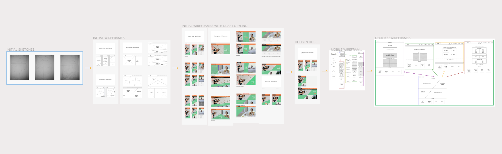

<h1 align="center"><em>b</em>Boulder Website</h1>
Created for the purpose of advertising <em>b</em>Boulder; a fictional indoor bouldering centre that also focuses on maintaining physical wellbeing. The website will showcase the facilities through images/videos, provide useful information regarding the location and services available.

## User Experience (UX)

### Considerations:

#### Strategy:
* Responsiveness = The site should be responsive on all devices from mobile to desktop
* Accessibility = the site should meet all accessibility requirements, allowing anyone to use regardless of their abilities/needs.
* What does the client (<em>b</em>Boulder) expect from the site? = They want this to promote their business and encourage visits to their centre.
* What do they really need? = They need a website produced that is responsive, functional and professional 
* Audience = B2C; general public (all ages)
* What makes <em>b</em>Boulder special? = It has a focus on wellbeing/injury prevention.
* Why would a user want to use this? = They would be able to access information regarding; services, classes, pricing, location, imagery, safety information.

#### Scope:
I have listed the possible features below and ranked 1-5 in level of importance/relevance to user needs (1 being most important and viable/feasable):
* Classes for children and adults (1) 
* Location/map (1)
* Site navigation (1)
* Accessibility (1)
* Social networking information and links (1)
* Wellbeing services; Ice baths, osteopathy, stretching/warm up/cool down area with touchscreen technology (1)
* Logo (1)
* Ethos (2)
* Booking information (2)
* Safety information (2)
* Images/gallery (2)
* Background image (2)
* Video footage - iframe (3)
* Fully functional calendar for booking (4)
* Animated climber that climbs up and down on the side of the page when scrolling (5)
* Bar to indicate current level of busyness (5)

Following research and review of scope, I have decided not to include:
* The animated climber - I believe this would distract from the content, would require levels of JavaScript that are outside of the project scope and would take up more time than appropriate for the value provided.
* Bar to indicate current level of busyness - This would require levels of JavaScript that are outside of the project scope currently, and do not feel it is entirely necessary as far as user/business needs are concerned. Could potentially implement in the future.
* Fully functional calendar for bookings - again this will require JavaScript that is outside the scope of this project at this time. Could potentially implement in the future. For now I intend to include a mock form for bookings including a datepicker.

I will be including the remaining features within the site, implementing with HTML, CSS, JS and Bootstrap.

#### Structure:
- Consistency: 
    - Navigation to each page of the site will be displayed inline (by wording) on the top of each page when in desktop/tablet view. This will be reduced into a nested list for the mobile view and will expand to block view when hamburger icon is clicked.
    - Social networking will be displayed in the form of icons at the bottom of each page, and will open in a separate tab when clicked        
    - Content, imagery will have the same consistent flexible grid style across all pages.
    - Transitions, rollovers, tooltips etc will act consistently across all pages
- Predictability/Learnability: 
    - Content will appear and operate in predictable ways, based on usual site interactions
    - Accessibility; making text readable and understandable, providing text alternatives/captions for screen readers etc. 
    - Semantic HTML will be used throughout
    - Clicking on the logo will direct to the homepage
- Visibility:
    - All elements will be made visible on all devices where appropriate, discoverable and will include content hinting.
- Feedback:
    - Hover events for each link
    - A response to confirm booking was succesfull
    - A separate page to indicate an error if user tries to access an incorrect path within the domain.

#### Skeleton:
* Habits and conventions:
    - Users will navgate through the site by scrolling down the pages, through links in the navbar, media within the pages, icons and links within the footer (at the bottom)

* Design:

Initial designs created on paper then by using Adobe Powerpoint:

[Initial Sketches](/assets/resources/initial-sketches.png "Link to initial sketches image file")
 
[Initial Home Page Wireframes](assets/resources/initial-home-page-wireframes.png "Link to initial home page wireframes image file")
 
[Initial Home Page Wireframes With Design Ideas](assets/resources/initial-home-page-wireframes-with-style.png "Link to initial home page wireframes with style image file")
 
[Initial Home Page Wireframes Chosen Design](assets/resources/initial-home-page-chosen-style.png "Link to initial home page chosen style image file")

I progressed to using Figma and developed further by including layouts for the other pages and arrows to demonstrate navigation to these pages:

[Mobile Wireframes](assets/resources/mobile-wireframes.png "Link to mobile wireframes image file")
 
[Desktop Wireframes](assets/resources/desktop-wireframes.png "Link to desktop wireframes image file")

All of these designs can be viewed more closely by visiting my figma page below:

[Figma Wireframes Designs Page](https://www.figma.com/file/9Ioehs6ELzng3FZX2CQiR8/Page-Wireframes-for-bBoulder-Climbing-Centre-Site?type=design&node-id=21-1157&mode=design&t=Xg50D9xzmFzjb80e-0 "Link to Figma Wireframe Designs Page")
 

#### Surface:

Typography:
 
I have chosen the [Poppins](https://fonts.google.com/?query=poppins "link to Poppins google font") google font for the headers on my site as I felt this was a clear, readable font that was also pleasing to the eye. After researching, I have found a couple of other google fonts that complement this nicely; [Gravitas One](https://fonts.google.com/specimen/Gravitas+One?preview.text=bBoulder&query=Gravitas+One "link to Gravitas One google font") for the logo, and [Vollkorn](https://fonts.google.com/?query=vollkorn "link to Volkorn google font") for the general content.

Colour Scheme:
 
I have chosen to go with a colour palette that represents the feeling of the experience that the company offers:
- Orange (HEX #CC480F); fun, happiness, dynamic. 
- Green (HEX #3da369); renewal, healing, harmony.   
I had intially gone for a much darker green (#04861E) then I actually wanted in order to pass the contrast check. However when playing around to achieve a more preferrable green, I noticed the new green does pass when using large text for the foreground; which is my only intention for this green on the site.

I will also be using white, black and grey as neutral colours/shades for typography and background sections.

I used a contrast checker on webaim.org to ensure that the color scheme meets the Web Content Accessibility Guideliness for readability. 

## References

Typography: 
* <a href="https://fonts.google.com">Google Fonts</a> 
* <a href="https://www.creatopy.com/blog/google-font-pairings/">Creatopy font pairings article</a> 
* <a href="https://www.vev.design/blog/google-font-combinations/#:~:text=Poppins%20%2B%20Vollkorn,a%20header%20or%20body%20copy">Vev.design font pairings article</a> 

Colour Scheme: 
* <a href="https://webaim.org/resources/contrastchecker">Webaim contrast checker</a> 

Code:

* I have some used template code from Bootstrap documentation, such as the navbar to ensure responsiveness and a functioning collapsible menu - 
[Bootstrap Docs](https://getbootstrap.com/docs/5.3/getting-started/introduction/ "link to Bootstrap Docs")

* Tutorial used to understand how to place the two background images as desired for the homepage - 
[Youtube Tutorial](https://www.youtube.com/watch?v=iC6hzjR1luY "link to Youtube tutorial")

* Tutorial used understand how to create a triangle shape for the coloured banner - 
[CSS Tricks](https://css-tricks.com/snippets/css/css-triangle/ "link to CSS tricks tutorial")

* Footer layout inspired by the codeinstitute resume project - 
[Codeinstitute Link](https://learn.codeinstitute.net/courses/course-v1:codeinstitute+FE+2017_T3/courseware/616289d66b5641a3808cc43e53842695/b51f7b8b815c4bcd9979d2281b6d97a9/ "link to Codeinstitute resume project")

* Tutorial used to implement CSS variable colors - 
[CSS Tricks](https://www.w3schools.com/css/css3_variables.asp "link to CSS variable colors tutorial")

### Media: 

Home page:
* Background image 1 is from <a href="https://www.freepik.com/free-photo/cheerful-woman-climbing-wall-gym_5576896.htm#query=climbing%20indoor&position=0&from_view=search&track=ais">Freepik</a> 
* Background image 2 is from <a href="https://www.freepik.com/free-photo/man-doing-his-self-care-ritual_20935535.htm#query=person%20in%20bath&position=5&from_view=search&track=ais#position=5&query=person%20in%20bath">Freepik</a>

About page:
* Bouldering facilities video is from <a href="https://www.pexels.com/video/athletes-climbing-a-wall-7591810/">Pexels</a> 
* Image 1 is from <a href="https://www.freepik.com/free-photo/medium-shot-friends-climbing-wall_44983886.htm#query=climbing%20indoor&position=25&from_view=search&track=ais">Freepik</a> 
* Image 2 is from <a href="https://www.freepik.com/free-photo/full-shot-woman-climbing-wall_44983705.htm#query=climbing%20indoor&position=37&from_view=search&track=ais">Freepik</a> 
* Image 3 is from <a href="https://unsplash.com/photos/man-in-black-and-white-crew-neck-t-shirt-and-black-shorts-standing-on-brown-concrete-RwjeAb3lXQo"> Unsplash</a> 
* Image 4 is from <a href="https://www.freepik.com/free-photo/professional-female-climber-bouldering-wall-indoors_26471812.htm#query=climbing%20indoor&position=0&from_view=search&track=ais">Freepik</a>

